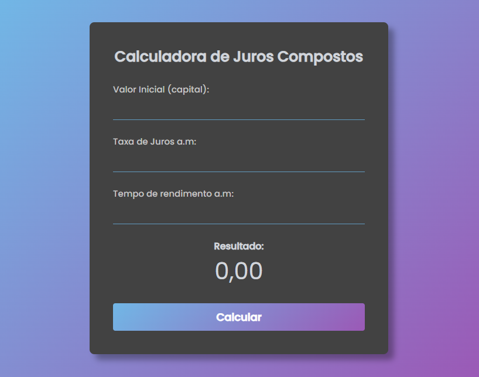

<h1 align="center"> Compound Interest Calculator </h1>

Projeto simples e responsivo de uma calculadora no qual o usuário pode fazer cálculos de juros compostos.  

  

  

 <h2 align="center"><a href="https://isadoraguiar.github.io/projects/basic-js/compound-interest-calculator" target="_blank">Projeto ao vivo</a></h2>

### 🚀 Tecnologias

Esse projeto foi desenvolvido com as seguintes tecnologias:

- HTML e CSS
- JavaScript
- Git e Github

### :memo: Licença

Esse projeto está sob a licença MIT.

---

Desenvolvido por <a href="https://www.youtube.com/watch?v=9ImvH4bzr-k" target="_blank">Larissa Kich</a> e responsividade por <a href="https://www.linkedin.com/in/isadoraguiar/" target="_blank">Isadora Aguiar</a> :wave:
