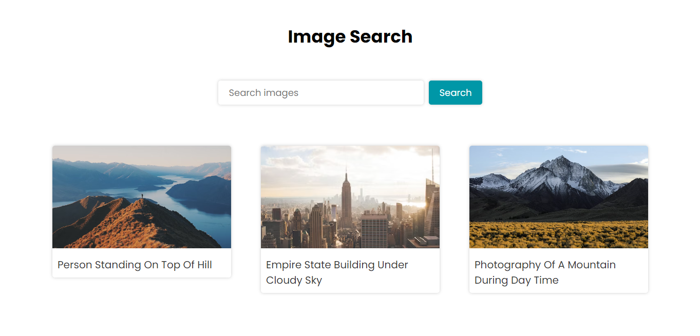

<h1 align="center"> Image Search </h1>

Neste aplicativo o usuário pode buscar imagens de acordo com o tema inserido no campo "Search images". No projeto foi utilizada a API do banco de imagens Unsplash.  

  

  

 <h2 align="center"><a href="https://isadoraguiar.github.io/projects/image-search" target="_blank">Projeto ao vivo</a></h2>

### 🚀 Tecnologias

Esse projeto foi desenvolvido com as seguintes tecnologias:

- HTML e CSS
- JavaScript
- Git e Github

### 🚀 Projeto

Este aplicativo foi inspirado no projeto do canal "JavaScript King".

### :memo: Licença

Esse projeto está sob a licença MIT.

---

Feito com ♥ por Isadora Aguiar :wave:
