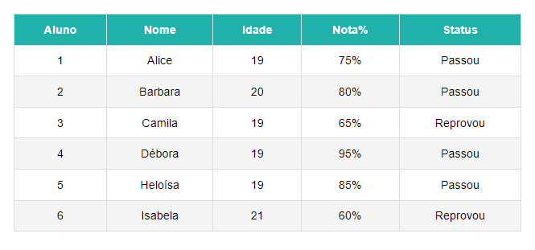

<h1 align="center"> Simple Table </h1>

Projeto de uma tabela simples com responsividade.  

  

  

 <h2 align="center"><a href="https://isadoraguiar.github.io/projects/responsive-tables/simple-table" target="_blank">Projeto ao vivo</a></h2>

### 🚀 Tecnologias

Esse projeto foi desenvolvido com as seguintes tecnologias:

- HTML
- CSS
- Git e Github

### :memo: Licença

Esse projeto está sob a licença MIT.

---

Feito com ♥ por Isadora Aguiar :wave:
