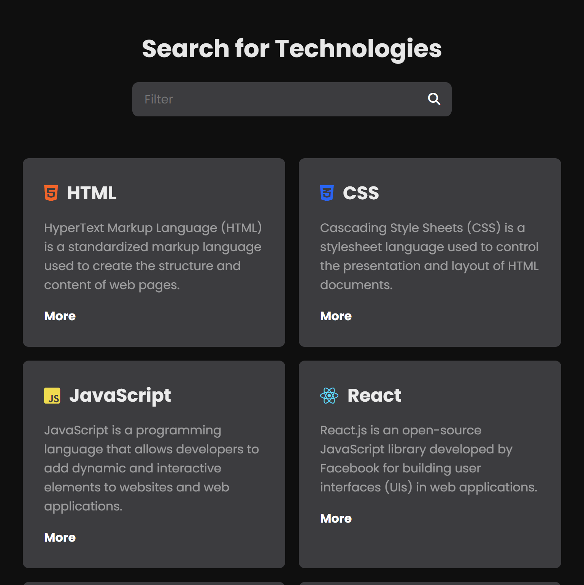

<h1 align="center"> Search Filter </h1>

This search bar efficiently filters through various options, enabling users to swiftly locate precisely what they need within your application.
   

  

  

 <h2 align="center"><a href="https://isadoraguiar.github.io/projects/search-filter" target="_blank">Projeto ao vivo</a></h2>

### 🚀 Tecnologias

Esse projeto foi desenvolvido com as seguintes tecnologias:

- HTML e CSS
- JavaScript
- Git e Github

### :memo: Licença

Esse projeto está sob a licença MIT.

---

Feito com ♥ por Isadora Aguiar :wave:
